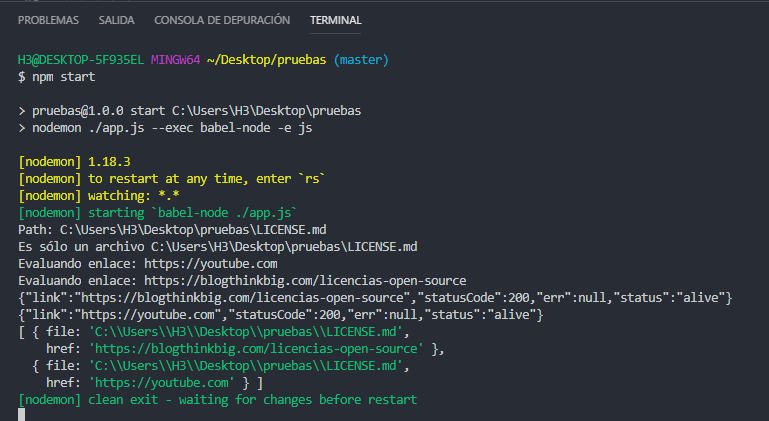
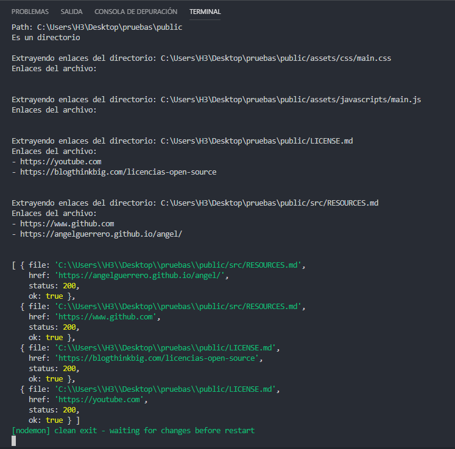

# Ejercicio para obtener enlaces

Este es un ejercicio que me pidieron ayuda, en `javascript` para obtener los enlaces de los archivos de tipo markdown.

# Uso

Clonar: `git clone https://github.com/AngelGuerrero/get-links-markdown.git`

Ejecutar: 

1. `cd get-links-markdown`
2. `npm install`
3. `npm start`

# Capturas de pantalla

Leyendo un archivo `markdown`

Leyendo un directorio con archivos `markdown`
